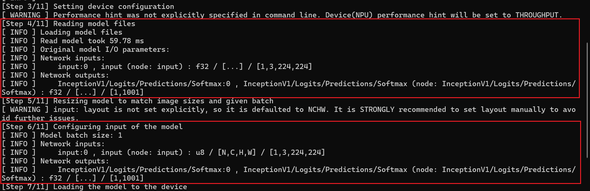

# How to test

## compilerTest

`compilerTest` can check full Driver Compiler API demo.

Gerenal command:
```bash
./compilerTest <blobfile>.xml <blobfile>.bin output.net
./compilerTest <blobfile>.xml <blobfile>.bin output.net config.file
```

For example, a config for googlenet-v1 is as follows:
```
--inputs_precisions="input:fp16" --inputs_layouts="input:NCHW" --outputs_precisions="InceptionV1/Logits/Predictions/Softmax:fp16" --outputs_layouts="InceptionV1/Logits/Predictions/Softmax:NC" --config NPU_PLATFORM="3720" DEVICE_ID="NPU.3720" NPU_COMPILATION_MODE="DefaultHW" NPU_COMPILATION_MODE_PARAMS="swap-transpose-with-fq=1 force-z-major-concat=1 quant-dequant-removal=1 propagate-quant-dequant=0"
```

In the config, the necessary command params are (need to be passed in order):
- `inputs_precisions`: Precision of input node.
- `inputs_layouts`: Layout of input node.
- `outputs_precisions`: Precision of output node.
- `outputs_layouts`: Layout of output node.

The optional command params are:
- `config`: set device info, log level and other properties defined in [`Supported Properties` part](https://github.com/openvinotoolkit/openvino/blob/master/src/plugins/intel_npu/README.md#supported-properties).
- `NPU_COMPILATION_MODE_PARAMS`: set compile config defined in [here](../../../src/vpux_compiler/include/vpux/compiler/core/pipelines_options.hpp).

>Note: In `compilerTest`, there defined the [default config](https://github.com/openvinotoolkit/npu_compiler.git/blob/master/src/vpux_driver_compiler/test/compilerTest.c#L231) file for googlenet-v1. If you not pass config file in command line, this default config will be used for the tested model.

To obtain a complete configuration file for a model, here is an example:

To get a config file, you need run the test model by benchmark first to get its node names. Run `./benchmark -m /path/to/model.xml` in windows git bash or linux shell, here using googlenet-v1 as example:
```bash
./benchmark_app -m /path/to/googlenet-v1.xml
```
The output info of `[step4/11] Reading model files` and `[step6/11] Configuring input of the model` shows the input and output node info. The log info of googlenet-v1 is as following image:
    

Each parameter is composed of a node name and precision separate by a colon. If the parameter contain multiple input nodes or output nodes, separate each node with a space between them.

## profilingTest

`profilingTest` is used to output profiling information. You can test it in git bash on windows or linux shell.

Gerenal command:
```bash
./profilingTest <blobfile>.blob profiling-0.bin
```

To get the <blobfile>.blob,  please use the compilerTest or [compile_tool](https://github.com/openvinotoolkit/npu_compiler.git/tree/master/tools/compile_tool) of [NPU-Plugin Project].

To get the profiling-0.bin and more profiling detail, please see **[how to use profiling.md](../../../guides/how-to-use-profiling.md)** in [NPU-Plugin Project].


## loaderTest

`loaderTest` is used to check driver compiler header whether is available. You can test it in git bash on windows or linux shell.

Gerenal command:
```bash
./loaderTest -v=1
./loaderTest -v=0
```


## vpuxCompilerL0Test

`vpuxCompilerL0Test` is the test suit of the driver compiler.

To run vpuxCompilerL0Test, you need to set `POR_PATH` manually. Here use this [POR model](https://af01p-ir.devtools.intel.com/artifactory/ir-public-models-ir-local/20230703_vpu-models-mtl-por-ir_v11_ov_2023.0.0-10926-b4452d56304.tar.gz) as example to test with the following command:

```bash
#copy and unpack POR model to special location.
tar -zxvf path/to/por_model
export POR_PATH=/path/to/por_model
```

You also need to set `CID_TOOL` manually to load the config for testing. `CID_TOOL` is the release-tools folder of [CiD Project] repo. Set `CID_TOOL` with the following command:
```bash
export CID_TOOL=/path/to/CiD-Repo/release-tools
```

You can run all the test suit of the driver compiler with the following command:
```bash
./vpuxCompilerL0Test
```
Or you can run the tests via the gtest_filter, e.g., if you want to test the resnet-50-pytorch, you can run:
```bash
./vpuxCompilerL0Test --gtest_filter=*resnet*50*pytorch*
```


>Note: For more debug method and detail, refer to **[how to debug](../../vpux_compiler/docs/guides/how_to_debug.md)** in vpux_compiler part.


[OpenVINO Project]: https://github.com/openvinotoolkit/openvino
[NPU-Plugin Project]: https://github.com/openvinotoolkit/npu_compiler.git
